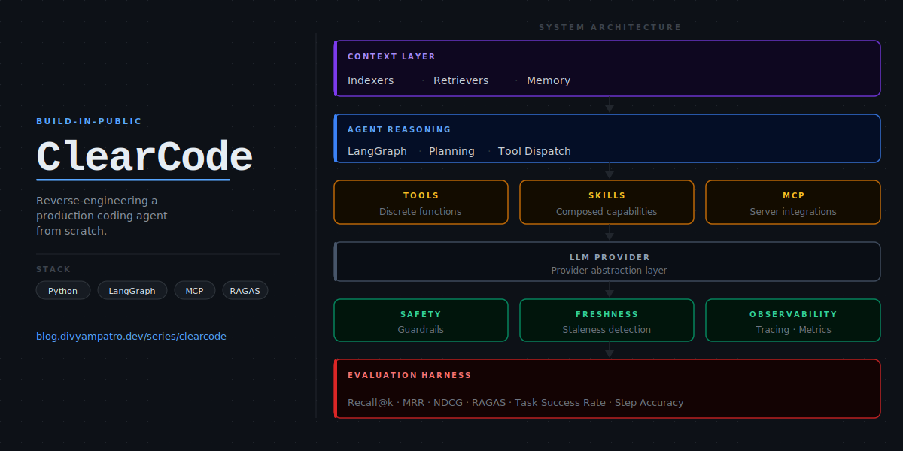

# ClearCode



<p align="center">
  
  
  
  
</p>

> Reverse-engineering a production-grade autonomous coding agent — one layer at a time.

I use Claude Code daily. At some point that stopped being enough — I wanted to understand exactly what happens between a natural-language prompt and a committed code change. ClearCode is my attempt to build that understanding by constructing a full coding agent from scratch, with every architectural decision documented publicly.

This is not a tutorial and not a clone. It is a rigorous, build-in-public engineering project with production-level ambitions: layered architecture, a complete evaluation harness, and honest write-ups on what works and what doesn't.

Companion series: [blog.divyampatro.dev/series/clearcode](https://blog.divyampatro.dev/series/clearcode)

---

## What works today

A working code assistant that runs as a local REPL. Point it at any codebase, ask questions, and give it tasks. It indexes the source files, retrieves relevant context, reasons across multiple tool calls, and carries memory across turns.

```bash
cd /path/to/your/project
poetry run clearcode
```

Four capabilities are live. All examples below are real output run against actual codebases.

**Retrieval** — dense, sparse, and hybrid, all switchable via a single config field.

**Agent reasoning** — chains tool calls to navigate codebases, read files, and trace logic across functions.

**Skills** — domain knowledge packaged as structured instruction sets, loaded on demand when the request matches.

**Memory** — context persists across turns within a session so follow-up questions build on what was already established.

**MCP** — the agent reaches beyond the local filesystem through Model Context Protocol servers. GitHub and filesystem ship by default; adding any new server is a one-line config change.

---

**Dense retrieval** — semantic similarity. Best for conceptual and design questions where exact wording doesn't match the source.

```
> /ask what is the philosophy behind not indexing nested functions?

The design philosophy is outlined across code_parser.py and CLAUDE.md. The _walk
function (lines 113–135) stops recursing the moment it hits a named block node,
ensuring that each top-level function or class is indexed as a single coherent
unit. Indexing nested functions separately would duplicate context — the outer
function already contains the inner one — and produce misleading chunk boundaries.

This also simplifies the stable chunk ID scheme (source::name::start_line) used
for idempotent upserts in ChromaDB, where collisions on nested definitions with
the same name would silently overwrite chunks.
```

---

**Sparse retrieval (BM25)** — exact keyword matching. Best for precise identifier and constant lookups.

```
> /ask what value does CHUNK_OVERLAP have and where is it defined?

CHUNK_OVERLAP is used in the _sliding_window function in
clearcode/context/indexers/code_parser.py at line 154, where it controls the
step size between successive window positions as CHUNK_SIZE - CHUNK_OVERLAP.
```

*Dense on the same question* retrieved the value (10) from CLAUDE.md where "10-line overlap" appears as prose — but missed the code location. *Sparse* found the exact usage site. Neither retrieved the constant definition itself (lines 44–47 in code_parser.py), because module-level constants between functions don't fall inside any indexed AST chunk — an honest limitation of the current chunking strategy.

---

**Hybrid retrieval** — dense + BM25 fused. Best when the question mixes exact identifiers with conceptual reasoning.

```
> /ask how does _extract_name fall back when no identifier node is found, and
  why does that cause a problem with BLOCK_NODE_TYPES like arrow_function?

_extract_name (code_parser.py, lines 138–143) iterates over the children of a
block node looking for a child with type "identifier", "name", or
"property_identifier". If none is found, it returns node.type as a fallback —
so for an arrow_function node with no direct identifier child, the chunk name
becomes "arrow_function".

This is a problem because the identifier for an arrow function (const x = () => {})
lives on the parent variable_declarator, not on the arrow_function node itself.
The fallback produces a generic, non-unique name that collides across all
anonymous arrow functions in the same file, and makes retrieval results
meaningless for JS codebases heavy in functional patterns.
```

This question contains exact identifiers (`_extract_name`, `BLOCK_NODE_TYPES`, `arrow_function`) that BM25 pins down, and conceptual reasoning about parent/child AST relationships that dense embeddings surface. Neither mode alone retrieves the full picture.

---

**Agent reasoning** — when retrieval alone isn't enough, the agent chains tool calls to build a complete picture.

```
> /ask Trace what happens from the moment a user submits the add-task form to
  when the new task appears on screen. Give me the exact function call chain.

Here's the detailed trace of what happens when a user submits the add-task form:

1. Event Listener and Form Submission
   The process begins when an event listener captures the form submission event,
   prevented from its default action via event.preventDefault(). Defined in
   todo-app/js/scripts.js, lines 102–115.

2. Task Title Extraction and Verification
   The task title is extracted with taskInput.value.trim(). If the title is
   empty, focus returns to the input field and the function exits.

3. addTask(title) — lines 73–82
   Creates a new task object and unshifts it to the front of the tasks array.
   id is generated with crypto.randomUUID() or String(Date.now()) as a fallback.
   Calls saveTasks() then renderTasks().

4. saveTasks() — lines 14–16
   Serialises the tasks array to localStorage under the key "orbitTasks".

5. renderTasks() — lines 38–71
   Clears the current task list (taskList.innerHTML = ''), re-renders every
   visible task as a <li> with a check button, title span, and delete button,
   then calls updateStats() to refresh the counters.

6. Interface Update
   Input field is cleared and refocused. The empty-state element is toggled
   based on whether any visible tasks remain.
```

The agent read `scripts.js` via the filesystem MCP server, found the exact line ranges, and traced the full call chain — not from memory, but from the actual file.

---

**Skills** — domain knowledge packaged as structured instruction sets, loaded on demand.

Skills use a three-tier progressive disclosure model to keep token costs low while making full expertise available on demand.

**Tier 1 — always in the system prompt:** A compact index of skill names, descriptions, and `when_to_use` keywords. The agent sees this on every query but pays only a few tokens per skill regardless of how detailed the skill body is.

**Tier 2 — loaded on match:** When the user's request matches a skill's keywords, the agent calls `load_skill(name)` to retrieve the full `SKILL.md` body — complete instructions, decision rules, code templates. This happens once per relevant query, not on every turn.

**Tier 3 — fetched individually:** Skills can ship support files (scripts, templates, reference docs) inside their folder. The agent sees a listing of available files after loading Tier 2 and reads only the ones the task actually needs.

This means a project with twenty specialised skills costs the same as one with zero until a skill is triggered. Skills live in `.clearcode/skills/<name>/SKILL.md` in the project you're querying.

```
> /ask I have a 40-page financial report PDF with embedded tables on every
  page. I need to extract all of them into a single pandas DataFrame.

To extract tables from a multi-page PDF into a single DataFrame, use pdfplumber:

    import pdfplumber
    import pandas as pd

    with pdfplumber.open("your_report.pdf") as pdf:
        all_tables = []
        for page in pdf.pages:
            tables = page.extract_tables()
            for table in tables:
                if table:
                    df = pd.DataFrame(table[1:], columns=table[0])
                    all_tables.append(df)

    combined_df = pd.concat(all_tables, ignore_index=True)

pdfplumber preserves table geometry better than pypdf for dense financial
layouts. If a page has no discernible table structure, extract_tables()
returns an empty list — the guard (if table) handles that safely.
```

The `pdf` skill was loaded from `.clearcode/skills/pdf/SKILL.md`. The agent did not guess at the approach — it followed instructions that encode hard-won knowledge about which library to use and why.

---

**Memory** — context carries across turns within a session, stored in SQLite via LangGraph checkpointing.

```
> /ask What is the name of the localStorage key this app uses, and what does
  each task object look like — list its exact fields?

The localStorage key is "orbitTasks".

Each task object has three fields:
  - id        unique identifier — crypto.randomUUID() with Date.now() fallback
  - title     the text of the task
  - completed boolean

> /ask Perfect. Now I want to support multiple named lists (Work, Personal).
  Using the storage key you just identified, propose the minimal change.

Instead of the single key "orbitTasks", use a dynamic key based on the list
name — "orbitTasks-Work", "orbitTasks-Personal", and so on.

Two functions need to change:

    function saveTasks(listName) {
        localStorage.setItem(`orbitTasks-${listName}`, JSON.stringify(tasks));
    }

    function addTask(title, listName) {
        tasks.unshift({
            id: crypto.randomUUID ? crypto.randomUUID() : String(Date.now()),
            title,
            completed: false
        });
        saveTasks(listName);
        renderTasks();
    }

Everything else — toggleTask, deleteTask, renderTasks — remains unchanged.
```

The second answer picks up `"orbitTasks"` from the first without re-searching. Sessions persist to `.clearcode/memory/memory.db` and can be resumed with `/switch <session_id>`.

---

**MCP** — the agent reaches beyond the local filesystem through Model Context Protocol servers, configured in a single JSON file.

Two servers ship by default: a GitHub server (public repos work unauthenticated; add `GITHUB_TOKEN` for private repos and write access) and a filesystem server scoped to the CWD at launch. Adding a new server — Jira, Linear, Slack, a database — is a one-entry change in `clearcode_mcp_servers.json`. The agent picks it up at next startup with no code changes required.

```
> /ask Go to the GitHub repo f2015537/clearcode and look at the last 5 commits
  on main. Summarise what has been built layer by layer.

Here is a summary of the last 5 commits on the main branch:

• cf98612 — "Add agent, skills, and memory examples to README"
  Documents the system's live capabilities with real output — code navigation,
  skill-driven answers, and session memory continuity.

• 6dd6b3e — "Update CLAUDE.md and README to reflect current project state"
  Marks agent, memory, MCP, and skills layers complete. Removes the local
  filesystem tools now covered by the filesystem MCP server.

• d9db21f — "Add filesystem MCP server; remove local filesystem tools"
  Shifts filesystem operations to a centralised MCP server scoped to CWD —
  same capabilities, no bespoke tool code to maintain.

• 914e491 — "Strengthen skill trigger with imperative load_skill instruction"
  Makes skill activation directive rather than suggestive, ensuring the agent
  reliably loads instructions before acting on a matched request.

• c839221 — "Update CLAUDE.md to reflect skills, MCP, and async agent state"
  Aligns documentation with the async agent, skills registry, and MCP wiring
  added in the preceding commits.
```

The agent called the GitHub MCP's `list_commits` tool, retrieved live data from the API, and composed the summary — no local git history involved.

---

| Command | Description |
|---------|-------------|
| `/ask <question>` | Ask a question about the indexed codebase |
| `/show_index` | Inspect all indexed chunks |
| `/new_session` | Start a fresh conversation |
| `/switch <session_id>` | Resume a past session |
| `/session` | Show current session ID |
| `/exit` | Quit |

---

## Architecture

The system is decomposed into focused, independently testable layers. Each layer has a clearly defined interface so it can be built, evaluated, and improved without breaking adjacent layers.

```
clearcode/
│
├── context/              # Context layer — built
│   ├── indexers/         # AST-aware chunking + ChromaDB / Qdrant backends
│   └── retrievers/       # Semantic and hybrid retrieval
│
├── agent/                # Agent reasoning layer — built
├── memory/               # Short-term memory + session management — built
├── mcp/                  # MCP server integrations (GitHub, filesystem) — built
├── skills/               # Progressive-disclosure skills system — built
├── tools/                # Local LangChain tools (search, terminal)
├── llm/                  # LLM + embedder provider abstraction
├── observability/        # Structured logging
│
├── safety/               # Input/output safety guardrails        — planned
├── freshness/            # Staleness detection and re-indexing   — planned
│
└── eval/                 # Evaluation harness                   — planned
    ├── retrieval/        # Recall@k · MRR · NDCG · Hit Rate
    ├── context/          # Context precision and recall
    ├── generation/       # Faithfulness and answer relevancy (RAGAS)
    └── agent/            # Task success rate and step accuracy
```

---

## Context layer

The context layer is the foundation everything else builds on. Getting it right matters more than moving fast.

**Chunking** — `code_parser.py` uses tree-sitter to walk the AST and extract named blocks (functions, classes, methods) across 15 languages. It stops at the top-level block and does not index nested functions separately, keeping chunks semantically coherent. For text and config files with no meaningful AST, it falls back to a sliding window. One correctness detail: tree-sitter returns byte offsets, not character offsets, so all source slicing is done on the encoded bytes before decoding — otherwise multi-byte characters silently truncate chunk names.

**Indexing** — Three backends, all behind a factory interface. Switching is a one-line change in `config.yaml`:

| Backend | Mode | Notes |
|---------|------|-------|
| ChromaDB | Dense | Local, no cloud account needed |
| Qdrant (semantic) | Dense | Cloud-hosted, pure embedding similarity |
| Qdrant (hybrid) | Dense + BM25 sparse | Best retrieval quality — active default |

**Hybrid retrieval** — The Qdrant hybrid backend stores two vector representations per chunk: a dense embedding from `text-embedding-3-small` capturing semantic meaning, and a sparse BM25 vector capturing exact keyword overlap. At query time, both are scored and fused. This catches cases where pure semantic search misses exact identifiers or rare terms, and where keyword search misses conceptually related code.

---

## Evaluation

The eval layer is first-class, not an afterthought. Retrieval quality, context quality, generation quality, and end-to-end agent performance will each be measured with industry-standard metrics before any layer is considered complete. This makes regressions visible and improvements measurable.

---

## Series

Full series index: [blog.divyampatro.dev/series/clearcode](https://blog.divyampatro.dev/series/clearcode)

| Part | Topic | Status |
|------|-------|--------|
| 1 | [Architecture and design decisions before writing any code](https://blog.divyampatro.dev/clearcode-part-1-reverse-engineering-a-coding-agent-before-writing-a-single-line-of-code) | Published |
| 2 | [Context layer: AST-aware indexing, vector stores, and hybrid retrieval](https://blog.divyampatro.dev/clearcode-part-2-ast-aware-indexing-vector-stores-and-hybrid-retrieval) | Published |
| 3 | [Agent reasoning layer: async agent, tool dispatch, and persistent memory](https://blog.divyampatro.dev/clearcode-part-3-memory-agent-reasoning-skills-and-mcp) | Published |

---

## Stack

| Layer | Technology |
|-------|-----------|
| Language | Python 3.12 |
| Agent orchestration | LangChain + LangGraph |
| LLM | OpenAI GPT-4o · Anthropic Claude (configurable) |
| Embeddings | OpenAI `text-embedding-3-small` · HuggingFace (configurable) |
| Vector store | Qdrant (hybrid) · ChromaDB (local) |
| Sparse embeddings | BM25 via fastembed |
| Code parsing | tree-sitter · tree-sitter-languages (15 languages) |
| Memory | LangGraph `AsyncSqliteSaver` + summarization middleware |
| Tool protocol | MCP via `langchain-mcp-adapters` (GitHub + filesystem servers) |
| Evaluation | RAGAS · custom retrieval metrics (upcoming) |

---

## Getting started

**Prerequisites:** Python 3.12, [Poetry](https://python-poetry.org)

```bash
# 1. Clone and install
git clone https://github.com/f2015537/clearcode.git
cd clearcode
poetry install

# 2. Configure credentials
cp .env.example .env
# Edit .env and add your API keys

# 3. Activate the virtualenv
source $(poetry env info --path)/bin/activate

# 4. Navigate to any repo you want to query and run
cd /path/to/your/project
clearcode
```

**ChromaDB vs Qdrant for multi-project use**

ChromaDB stores its index in a `.chromadb/` folder inside whichever directory you run `clearcode` from — each project automatically gets its own isolated index. This is the simplest setup for querying multiple codebases.

Qdrant uses a single named collection (`codebase` by default). Running `clearcode` in a new project will reuse the existing collection rather than re-indexing, so you would need to either delete the collection between projects or configure a different `qdrant.collection_name` per project in `config.yaml`.

For multi-project use, ChromaDB is recommended. Set it in `clearcode/config.yaml`:

```yaml
rag:
  mode: semantic

vector_store:
  provider: chromadb
```

---

Follow along: [blog.divyampatro.dev/series/clearcode](https://blog.divyampatro.dev/series/clearcode)
